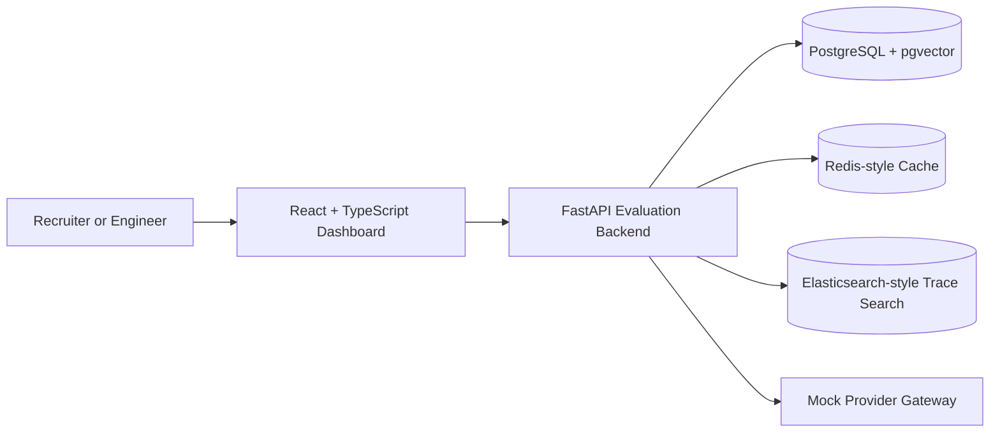

# LLM Evaluation, RAG & Observability Platform

A full-stack platform for evaluating LLM outputs, testing retrieval quality, and inspecting observability traces across an evaluation workflow. The project combines a FastAPI backend, React dashboard, PostgreSQL/pgvector storage, Redis-style caching, and Elasticsearch-style trace search to show how baseline and candidate LLM systems can be compared in a repeatable local environment.

The public repository is a runnable demo version focused on architecture clarity, core evaluation mechanics, and recruiter-friendly review.

## Project Summary

The repository contains:

- FastAPI backend with a `/health` endpoint
- Evaluation run API skeleton with seeded demo run data
- Deterministic evaluation cache-key generation for Redis-style correctness
- React + TypeScript + Vite frontend landing page
- Docker Compose services for backend, frontend, PostgreSQL with pgvector, Redis, and Elasticsearch
- Configuration through environment variables with `.env.example`

Future implementation phases will deepen the retrieval implementation, provider adapters, trace persistence, and trace search.

## Architecture Diagram



## Local Run Instructions

Copy the example environment if you want to customize values:

```bash
cp .env.example .env
```

Run the full local stack:

```bash
docker compose up --build
```

Then open:

- Frontend: http://localhost:5173
- Backend health: http://localhost:8000/health
- Backend API docs: http://localhost:8000/docs

Seeded API routes:

- `POST /api/runs`
- `GET /api/runs`
- `GET /api/runs/{run_id}`
- `GET /api/runs/{run_id}/traces`

Backend-only local run:

```bash
cd backend
python -m venv .venv
source .venv/bin/activate
pip install -r requirements.txt
uvicorn app.main:app --reload
```

Frontend-only local run:

```bash
cd frontend
npm install
npm run dev
```

## Resume Claim Mapping

This repository is structured to demonstrate:

- FastAPI evaluation backend
- baseline vs candidate evaluation runs
- hybrid RAG with dense retrieval + BM25 + reciprocal rank fusion
- recall@10 and nDCG@10 calculation
- Redis-style cache-key correctness
- judge scoring and pass/fail aggregation
- provider gateway abstraction
- OpenTelemetry-style trace records
- Elasticsearch-style trace search
- lightweight React dashboard

## Metrics Explanation

Seeded controlled demo metrics:

- dense-only `recall@10`: `0.69`
- hybrid `recall@10`: `0.84`
- dense-only `nDCG@10`: `0.62`
- hybrid `nDCG@10`: `0.79`
- judge agreement: `84%`
- cache hit rate: `40%`

Retrieval and evaluation metric definitions:

- `recall@10`: percentage of known relevant documents retrieved in the top 10 results
- `nDCG@10`: ranking-quality score that rewards placing more relevant documents higher in the top 10
- pass/fail aggregation: combines judge outcomes into an explicit run-level result

## Local demo scope

- The public repo is a runnable demo version, not a production deployment.
- The workload is seeded and controlled for local review.
- Seeded metric values are clearly labeled as controlled demo metrics.
- Mock providers are used by default so the project can run without OpenAI, Anthropic, or AWS keys.
- It does not claim production usage, production traffic, or company deployment.
- Data services are configured for local development, not managed production deployment.
