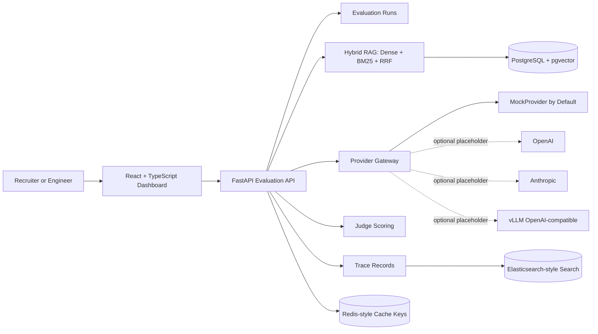

# LLM Evaluation, RAG & Observability Platform

## Project summary

A full-stack LLM evaluation, RAG, and observability platform for comparing baseline and candidate systems, measuring retrieval quality, scoring answers with judge rubrics, and inspecting trace records across an evaluation workflow. The public repository is a runnable demo version that uses seeded data and mock providers by default so recruiters and engineers can review the architecture, API surface, tests, and dashboard locally.

## Screenshot

> Screenshot placeholder: run the frontend locally and replace this block with a dashboard capture when publishing the portfolio.

## Architecture diagram



## Local run instructions

Copy the example environment if you want to customize values:

```bash
cp .env.example .env
```

Run the full local stack:

```bash
docker compose up --build
```

Then open:

- Frontend dashboard: http://localhost:5173
- Backend health: http://localhost:8000/health
- Backend API docs: http://localhost:8000/docs

Backend-only local run:

```bash
cd backend
python -m venv .venv
source .venv/bin/activate
pip install -r requirements.txt
uvicorn app.main:app --reload
```

Frontend-only local run:

```bash
cd frontend
npm install
npm run dev
```

Seeded API routes:

- `POST /api/runs`
- `GET /api/runs`
- `GET /api/runs/{run_id}`
- `GET /api/runs/{run_id}/traces`

## Resume claim mapping

| Claim | Where it is demonstrated |
| --- | --- |
| FastAPI evaluation backend | `backend/app/main.py`, `backend/app/api/runs.py` |
| Baseline vs candidate evaluation runs | Seeded run API and dashboard run cards |
| Hybrid RAG retrieval | `backend/app/retrieval/hybrid.py` |
| Dense + BM25 + reciprocal rank fusion | `backend/app/retrieval/rrf.py`, seeded retrievers |
| `recall@10` and `nDCG@10` | `backend/app/retrieval/metrics.py`, tests |
| Redis-style cache-key correctness | `backend/app/cache/evaluation_keys.py`, tests |
| Judge scoring and pass/fail aggregation | `backend/app/judging/scoring.py`, tests |
| Provider gateway abstraction | `backend/app/providers/` |
| OpenTelemetry-style trace records | `TraceRecord` domain model and `/api/runs/{run_id}/traces` |
| Elasticsearch-style trace search target | Docker Compose service and trace schema shape |
| Lightweight React dashboard | `frontend/src/App.tsx` |

## Metrics explanation

Seeded controlled demo metrics:

- dense-only `recall@10`: `0.69`
- hybrid `recall@10`: `0.84`
- dense-only `nDCG@10`: `0.62`
- hybrid `nDCG@10`: `0.79`
- judge agreement: `84%`
- cache hit rate: `40%`

Metric definitions:

- `recall@10`: fraction of known relevant documents retrieved in the top 10 results.
- `nDCG@10`: ranking-quality score that rewards placing more relevant documents higher in the top 10.
- Judge pass/fail: an answer passes only when correctness >= 4, faithfulness >= 4, citation quality >= 3, and there is no critical unsupported claim.
- Judge agreement: whether judge A and judge B make the same pass/fail decision. Disagreements route to `manual_review`.
- Cache hit rate: percentage of seeded evaluation cases represented as cache hits in the controlled demo workload.

See [docs/metrics.md](docs/metrics.md) for formulas and edge cases.

## What is implemented for real

- FastAPI app with health and evaluation run routes.
- Domain models and Pydantic schemas for datasets, cases, runs, results, providers, judge scores, and traces.
- Seeded in-memory repository with demo run data.
- Reciprocal rank fusion over dense top 30 and BM25 top 30, using `k=60` and returning top 10.
- `recall@k` and `nDCG@k` calculations with pytest coverage.
- Deterministic cache-key generation with canonical JSON and SHA-256 hashing.
- Judge scoring thresholds and two-judge aggregation with manual review routing.
- Provider gateway abstraction with a working `MockProvider`.
- Structured trace records exposed through the API.
- React dashboard consuming the seeded backend APIs.
- Docker Compose wiring for backend, frontend, PostgreSQL/pgvector, Redis, and Elasticsearch.

## What is mocked by default

- LLM generation uses `MockProvider`.
- OpenAI, Anthropic, and vLLM providers are placeholders and do not call external APIs.
- Retrieval uses seeded sample results rather than live embeddings or a populated BM25 index.
- Evaluation runs are stored in memory for the demo.
- Trace search is shaped for Elasticsearch-style indexing, but traces are served from seeded demo storage.
- Metric values shown in the dashboard are controlled demo metrics, not production measurements.

## Limitations and honest scope

- This is a public runnable demo version, not production infrastructure.
- It does not claim production usage, production traffic, or company deployment.
- Seeded data is intentionally small and controlled for review.
- PostgreSQL, Redis, and Elasticsearch are included for local architecture demonstration, not managed production operations.
- There is no authentication, authorization, tenant isolation, or secret management beyond environment-variable placeholders.
- Real provider adapters need API clients, retries, rate limits, cost accounting, and error handling before production use.

## Future improvements

- Persist runs, results, cache entries, and traces with SQLAlchemy and PostgreSQL.
- Add pgvector-backed dense retrieval and a real BM25 index.
- Index trace records into Elasticsearch and add trace search APIs.
- Implement real OpenAI, Anthropic, and vLLM adapters behind the provider gateway.
- Add background evaluation execution and progress updates.
- Add dashboard filters for dataset, provider, status, case, and trace component.
- Add authentication and role-aware access control for non-demo deployments.

## Additional docs

- [Architecture](docs/architecture.md)
- [Metrics](docs/metrics.md)
- [vLLM deployment notes](docs/vllm_deployment.md)
