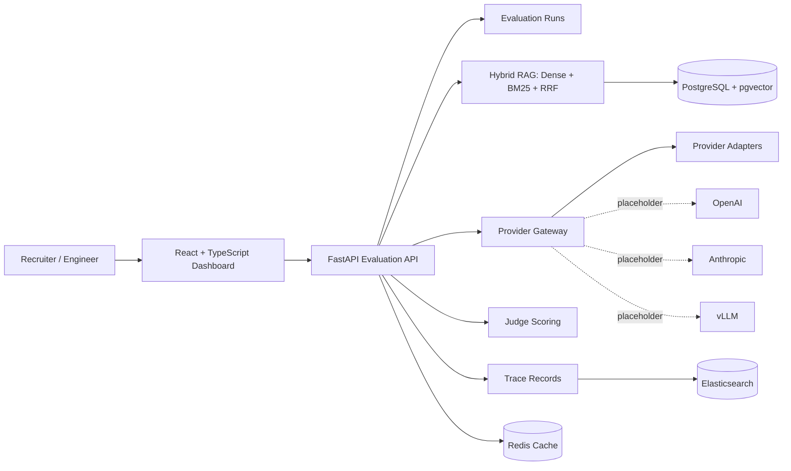

# LLM Evaluation, RAG & Observability Platform

A full-stack platform for evaluating RAG quality, model/provider behavior, cache correctness, judge agreement, and trace-level regressions across baseline and candidate LLM workflows.

The project wires together a FastAPI evaluation backend, hybrid retrieval with dense + BM25 + reciprocal rank fusion, deterministic cache-key generation, two-judge scoring, structured trace records, and a React/TypeScript dashboard for reviewing retrieval quality, answer quality, cache behavior, latency, and failures.

## What it does

You define a baseline and a candidate system, run an evaluation, and compare them. Under the hood:

- **Hybrid retrieval** pulls dense top-30 and BM25 top-30, then fuses them with reciprocal rank fusion (`k=60`) to produce a final top-10 ranking.
- **Two independent judges** score each answer on correctness, faithfulness, and citation quality. If they disagree on pass/fail, the case routes to manual review.
- **Deterministic cache keys** hash the full evaluation config (prompt, model, parameters, retrieval config, tools, judge rubrics) with SHA-256 so identical runs hit cache.
- **Structured trace records** capture what happened at each stage — gateway, cache, retrieval, provider, judge, tool, storage — shaped for Elasticsearch indexing.
- A **React dashboard** ties it together: run summaries, metric comparisons, cache behavior, judge agreement rates, and trace drilldown.

## Architecture



## Results on demo data

| Metric | Dense-only | Hybrid (RRF) |
| --- | --- | --- |
| recall@10 | 0.69 | **0.84** |
| nDCG@10 | 0.62 | **0.79** |

The fusion step is doing real work — hybrid recall jumps 15 points over dense-only, and nDCG confirms the ranking quality improves too, not just raw coverage.

Judge agreement sits at 84%, with disagreements routing to manual review rather than silently picking a winner. Cache hit rate in the demo is 40%, enough to show the deterministic key logic is working.

Formulas and edge-case handling are documented in [docs/metrics.md](docs/metrics.md).

## Running locally

The repository runs locally with seeded evaluation data and a mock provider by default, so the evaluation workflow can be reviewed without OpenAI, Anthropic, or AWS credentials.

Copy the example env file if you want to change defaults:

```bash
cp .env.example .env
```

Full stack (backend + frontend + Postgres + Redis + Elasticsearch):

```bash
docker compose up --build
```

Then open:
- Dashboard: http://localhost:5173
- API docs: http://localhost:8000/docs
- Health check: http://localhost:8000/health

<details>
<summary>Backend-only or frontend-only setup</summary>

**Backend (Bash)**
```bash
cd backend
python -m venv .venv
source .venv/bin/activate
pip install -r requirements.txt
uvicorn app.main:app --reload
```

**Backend (PowerShell)**
```powershell
cd backend
python -m venv .venv
.venv\Scripts\Activate.ps1
pip install -r requirements.txt
uvicorn app.main:app --reload
```

**Frontend**
```bash
cd frontend
npm install
npm run dev
```
</details>

## API routes

- `POST /api/runs` — create an evaluation run
- `GET /api/runs` — list all runs
- `GET /api/runs/{run_id}` — get a single run with results
- `GET /api/runs/{run_id}/traces` — get trace records for a run

## Code → resume claim mapping

| Claim | Where to look |
| --- | --- |
| FastAPI evaluation backend | `backend/app/main.py`, `backend/app/api/runs.py` |
| Baseline vs candidate runs | Run API + dashboard run cards |
| Hybrid RAG retrieval | `backend/app/retrieval/hybrid.py` |
| Dense + BM25 + RRF | `backend/app/retrieval/rrf.py` and tests |
| recall@10 and nDCG@10 | `backend/app/retrieval/metrics.py` and tests |
| Deterministic cache keys | `backend/app/cache/evaluation_keys.py` and tests |
| Judge scoring + aggregation | `backend/app/judging/scoring.py` and tests |
| Provider gateway abstraction | `backend/app/providers/` |
| Structured trace records | `TraceRecord` model, `/api/runs/{run_id}/traces` |

## What's next

The main gaps are swapping the mock provider for a real OpenAI/Anthropic adapter (with retries, rate limits, and cost tracking), persisting runs to Postgres with SQLAlchemy, and indexing traces into Elasticsearch so the search API actually queries something. After that: pgvector-backed dense retrieval, a real BM25 index, and dashboard filters for dataset/provider/status.

## Docs

- [Architecture deep-dive](docs/architecture.md)
- [Metrics formulas and edge cases](docs/metrics.md)
- [vLLM deployment notes](docs/vllm_deployment.md)