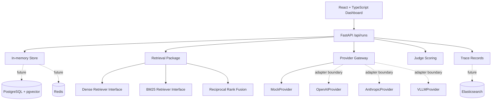

# Architecture

## System view

## Backend layout

- `app/api` — FastAPI routers
- `app/domain` — dataclass domain models and enums
- `app/schemas` — Pydantic request and response schemas
- `app/repositories` — in-memory store (SQLAlchemy swap target)
- `app/retrieval` — dense/BM25 interfaces, RRF, and retrieval metrics
- `app/cache` — deterministic evaluation cache-key generation
- `app/judging` — scoring thresholds and two-judge aggregation
- `app/providers` — provider gateway abstraction and adapters

## Data flow

The dashboard calls `/api/runs` for run summaries, `/api/runs/{run_id}` for a selected run's results, and `/api/runs/{run_id}/traces` for trace records. Each trace row is tagged with a component type (gateway, cache, retrieval, provider, judge, tool, or storage) so the dashboard can group and filter them.

## Storage and providers

Runs locally with in-memory data, no credentials needed. Docker Compose includes PostgreSQL/pgvector, Redis, and Elasticsearch — the containers are there so the storage boundaries are real even though the in-memory store stands in for now. Migration path: SQLAlchemy for persistence, pgvector for dense retrieval, Elasticsearch for trace search.

`BaseProvider` defines the generation interface. `MockProvider` is the active default. The OpenAI, Anthropic, and vLLM adapters define the interface contract but don't call out yet.