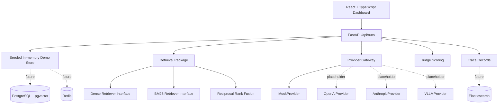

# Architecture

This project is a full-stack demo of an LLM evaluation, RAG, and observability platform. The code is intentionally small enough to scan quickly while still separating API routes, domain models, retrieval logic, cache-key logic, provider gateway logic, judge scoring, and frontend presentation.

## System view

## Backend layout

- `app/api`: FastAPI routers.
- `app/domain`: dataclass domain models and enums.
- `app/schemas`: Pydantic request and response schemas.
- `app/repositories`: seeded demo storage boundary, intended to be replaced or backed by SQLAlchemy.
- `app/retrieval`: dense/BM25 interfaces, seeded retrievers, RRF, and retrieval metrics.
- `app/cache`: deterministic evaluation cache-key generation.
- `app/judging`: scoring thresholds and two-judge aggregation.
- `app/providers`: provider gateway abstraction and mock/placeholder providers.

## Data flow

1. The dashboard calls `/api/runs`.
2. The backend returns seeded evaluation run summaries.
3. The dashboard loads a selected run with `/api/runs/{run_id}`.
4. The dashboard loads trace records with `/api/runs/{run_id}/traces`.
5. Trace rows describe gateway, cache, retrieval, provider, judge, tool, and storage components.

## Storage strategy

The current demo uses in-memory seeded data so the repository is runnable without provisioning or credentials. Docker Compose includes PostgreSQL with pgvector, Redis, and Elasticsearch so the intended production-shaped boundaries are visible, but the public demo does not claim production infrastructure.

## Provider gateway

`BaseProvider` defines the generation interface. `MockProvider` is the only active default provider. `OpenAIProvider`, `AnthropicProvider`, and `VLLMProvider` are placeholders for future adapter work and intentionally do not call external APIs.
